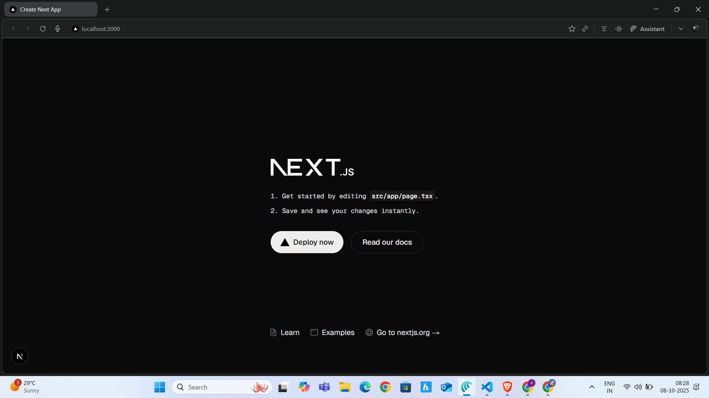
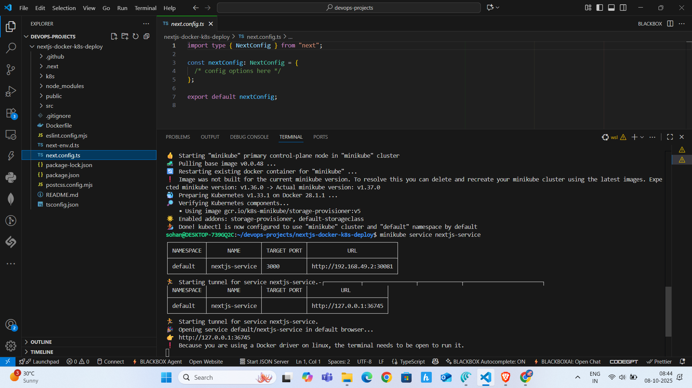

# Next.js Docker & Kubernetes Deployment

This project demonstrates how to deploy a **Next.js application** using **Docker** and **Kubernetes** (Minikube). It includes building a Docker image, deploying it as a Kubernetes Deployment, and exposing it via a NodePort Service.

---

## Table of Contents

- [Prerequisites](#prerequisites)  
- [Project Structure](#project-structure)  
- [Docker Setup](#docker-setup)  
- [Kubernetes Setup](#kubernetes-setup)  
- [Accessing the Application](#accessing-the-application)  
- [Screenshots](#screenshots)  
- [Troubleshooting](#troubleshooting)  
- [References](#references)  
- [Author](#author)

---

## Prerequisites

- Node.js v18+  
- npm  
- Docker  
- Minikube  
- kubectl  

---

## Project Structure

```

nextjs-docker-k8s-deploy/
├── .github/
├── .next/
├── k8s/
│   ├── deployment.yaml              
│   └── service.yaml           
├── node_modules/
├── public/
│   └── favicon.ico
├── src/
│   ├── pages/
│   │   ├── index.tsx
│   │   └── _app.tsx
│   └── components/               # Optional (if you add UI components)
├── screenshots/
│   ├── Homepage.png              # App running in browser
│   └── Minikube_output.png       # Terminal output showing successful deployment
├── .gitignore
├── Dockerfile
├── eslint.config.mjs
├── next-env.d.ts
├── next.config.ts
├── package-lock.json
├── package.json
├── postcss.config.mjs
├── README.md
└── tsconfig.json


````

---

## Docker Setup

1. **Set Minikube Docker environment**
```bash
eval $(minikube docker-env)
````

2. **Build Docker image**

```bash
docker build -t nextjs-docker-k8s-deploy .
```

3. **Run locally (optional)**

```bash
docker run -p 3000:3000 nextjs-docker-k8s-deploy
```

---

## Kubernetes Setup

1. **Apply combined Deployment and Service**

```bash
kubectl apply -f k8s/k8s.yaml
```

2. **Check Pods**

```bash
kubectl get pods
```

* `READY 1/1` → app is running

3. **Check Services**

```bash
kubectl get svc
```

---

## Accessing the Application

* **Minikube NodePort:**

```
http://<minikube-ip>:<nodeport>
```

* **Minikube tunnel (recommended for localhost access):**

```bash
minikube service nextjs-service
```

* The app will open in the browser at:

```
http://127.0.0.1:<tunnel-port>
```

> ⚠ For Docker driver on Linux, the terminal running `minikube service` must stay open.

---

## Screenshot

* Homepage:
  

* Minikube_output:
  

---

## Troubleshooting

* **ImagePullBackOff:** Make sure Docker image is built inside Minikube:

```bash
eval $(minikube docker-env)
```

* **SVC_UNREACHABLE:** Check Pods are running and `READY 1/1`.

* **Deployment update fails (immutable selector):**

```bash
kubectl delete deployment nextjs-deployment
kubectl apply -f k8s/k8s.yaml
```

---

## References

* [Next.js Docs](https://nextjs.org/docs)
* [Docker Docs](https://docs.docker.com/)
* [Kubernetes Docs](https://kubernetes.io/docs/home/)
* [Minikube Docs](https://minikube.sigs.k8s.io/docs/)

---

## Author

**Sohan Kumar Miryala**

* GitHub: [sohan181204](https://github.com/sohan181204)
* LinkedIn: [Miryala Sohan Kumar](https://www.linkedin.com/in/miryala-sohan-kumar-5642a626a/)

```

